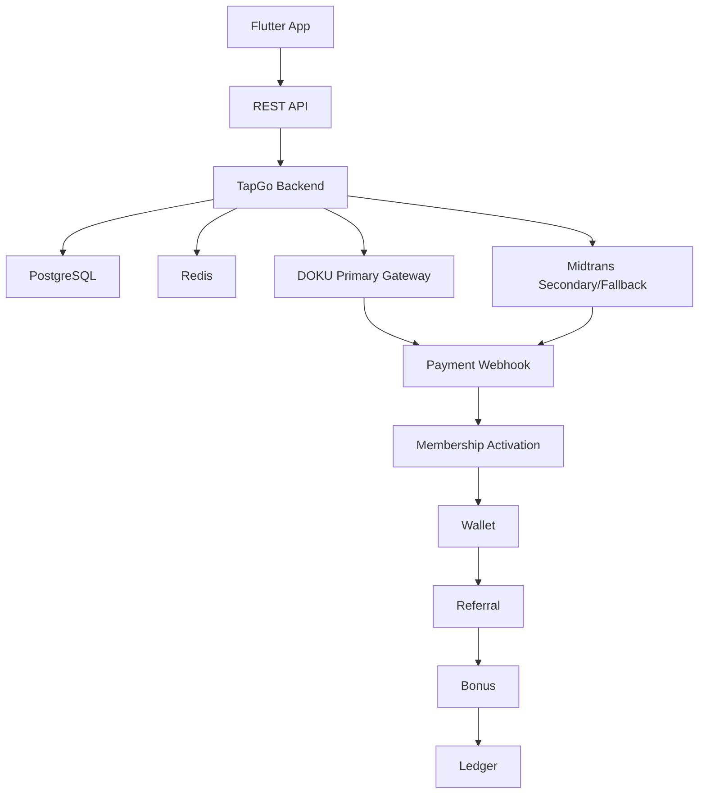

# TapGo System Architecture

## Production Architecture v1.0

## Payment Gateway Position

| Gateway | Role | TapGo v1.0 Status |
|---|---|---|
| DOKU | Primary payment gateway | Active integration path for checkout and webhook UAT |
| Midtrans | Secondary/fallback gateway | Kept ready while merchant review continues |
| Xendit | Not used | Not part of TapGo v1.0 payment architecture |

## Main Runtime Flow

1. User opens the Flutter app and calls the REST API.
2. Backend reads and writes transactional data in PostgreSQL.
3. Redis supports cache, rate limit, and operational runtime needs.
4. Membership checkout creates a payment through DOKU Checkout.
5. DOKU sends payment notification to the canonical webhook endpoint.
6. Backend validates signature, maps payment status, and applies idempotency.
7. Paid membership activates package entitlement.
8. Wallet, referral, bonus, and ledger records are created only once.
9. Midtrans remains available as secondary/fallback while review is ongoing.

## Canonical Payment Endpoints

| Purpose | Endpoint |
|---|---|
| DOKU create checkout payment | `POST /api/v1/payments/doku/create` |
| DOKU webhook | `POST /api/v1/webhooks/doku` |
| Midtrans fallback payment | Existing Midtrans payment flow |

## Release Constraints

- DOKU integration mode for TapGo v1.0 is `checkout`.
- `snap_direct` must remain inactive until separately implemented and tested.
- Secrets are backend-only and must never be embedded in Flutter.
- No Xendit endpoint, webhook, or credential is required for TapGo v1.0.
- Payment webhook processing must never downgrade paid invoices or duplicate bonus payouts.
