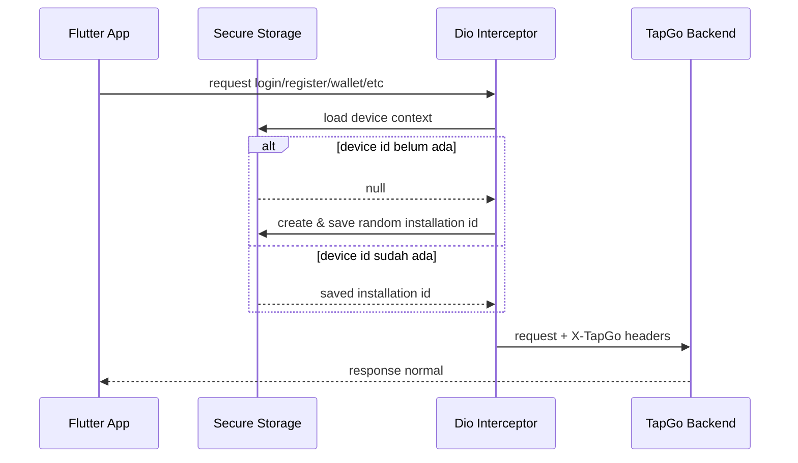

# TapGo Device Fingerprint Technical Design

Tanggal: 2026-06-17

## Tujuan

Menyediakan metadata perangkat yang stabil per instalasi untuk membantu backend mendeteksi pola multi-account, referral farming, dan penyalahgunaan bonus tanpa mengambil identifier sensitif perangkat.

## Prinsip Desain

1. Privacy-first.
2. Tidak memakai IMEI, Android ID mentah, serial number, atau data sensitif.
3. Stable per installation, bukan stable per hardware.
4. Backend melakukan monitoring dan flag suspicious, bukan hard block agresif.
5. Tidak mengubah flow login/register/membership yang sudah berjalan.

## Data yang Dikirim Mobile

| Field | Lokasi | Contoh | Keterangan |
| --- | --- | --- | --- |
| `X-TapGo-Device-Id` | Header | `tapgo-...` | ID acak per instalasi. |
| `X-TapGo-Device-Fingerprint` | Header | `tapgo:android:tapgo-...` | Synthetic fingerprint berbasis app installation. |
| `X-TapGo-App-Version` | Header | `1.0.1+2` | Versi app saat ini. |
| `X-TapGo-Platform` | Header | `android` | Platform dari `dart:io`. |
| `deviceId` | Register body | `tapgo-...` | Compatibility untuk backend register. |
| `deviceFingerprint` | Register body | `tapgo:android:tapgo-...` | Compatibility untuk backend register. |

## Penyimpanan Local

Storage:

```text
FlutterSecureStorage
AndroidOptions(encryptedSharedPreferences: true)
```

Keys:

```text
tapgo.device_id.v1
tapgo.device_fingerprint.v1
```

## Alur Request



## Backend Usage

Backend anti-abuse dapat memakai metadata ini untuk:

- registration event log
- same-device account count
- same-device referral chain
- suspicious flag
- bonus Basic farming monitoring

Rekomendasi backend tetap:

- hash fingerprint sebelum disimpan
- flag suspicious, bukan langsung blokir
- gunakan kombinasi phone, IP, user-agent, referral code, dan device fingerprint

## Batasan

1. Clear data atau uninstall akan mengganti ID.
2. App version saat ini masih konstanta manual.
3. Tidak mendeteksi hardware secara permanen.
4. Belum ada UI admin untuk review device fingerprint flags.

## Rekomendasi Lanjutan

P1 sebelum public launch besar:

- Pastikan backend migration anti-abuse sudah berurutan aman.
- Pastikan privacy policy/data safety menyebut device/app metadata untuk fraud prevention.
- Tambahkan report admin untuk suspicious registration.

P2:

- Gunakan `package_info_plus` untuk app version otomatis.
- Tambahkan device metadata ke support diagnostic screen non-sensitive.
